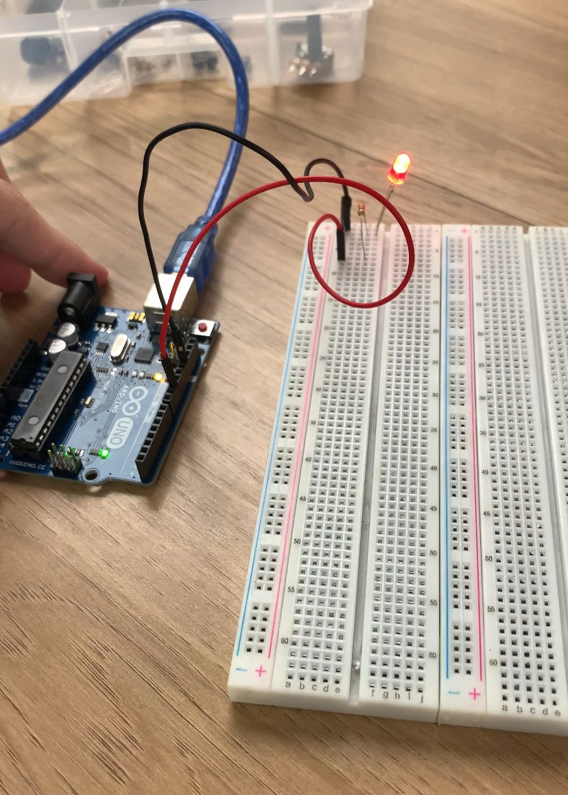
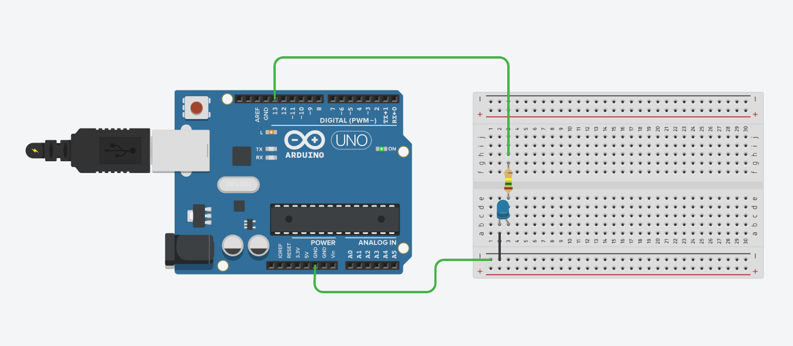

# Ponderada - Módulo 4

## Parte 1 - LED

Inicialmente, foi analisado o código responsável pelo acionamento de um LED conectado ao Arduino. O programa especifica o pino de saída utilizado e alterna o estado do LED entre ligado e desligado em intervalos regulares de tempo.

Segue a imagem de demonstração:

[ Clique aqui para ver o vídeo de demonstração](assets\video.mp4)

## Parte 2 — Blink Externo

Nesta fase, foi realizada a simulação do circuito no TinkerCad. O sistema foi configurado com um LED externo (OFF_BOARD) conectado ao pino digital do Arduino, acompanhado de um resistor para limitar a corrente e garantir a proteção do componente.

### Componentes utilizados: 

Arduino Uno: atua como o cérebro do circuito, enviando os sinais elétricos que controlam o acionamento do LED conforme o programa desenvolvido.

Protoboard: serve como base de montagem, permitindo interligar os componentes eletrônicos de forma prática, sem a necessidade de soldagem.

LED: diodo emissor de luz que indica visualmente o funcionamento do circuito, acendendo e apagando conforme as instruções do Arduino.

Resistor: componente responsável por controlar a intensidade da corrente elétrica que chega ao LED, protegendo-o contra sobrecarga.

Jumpers: cabos condutores que realizam as conexões entre os pinos do Arduino e os pontos da protoboard.

A simulação do circuito foi realizada no TinkerCad, utilizando um LED como elemento principal de teste.

🔗 [Ver projeto no TinkerCad](https://www.tinkercad.com/things/d5JDebmdUpF-ingenious-blorr?sharecode=r8KZVaabyJsxTJyoDTYQCAEKY5N1vupFRa6Fg9TO7qo)
